# DOKUMENTASI ANALISIS KEBUTUHAN DAN PERANCANGAN SISTEM COURSEHUB

> Dokumen laporan teknis berdasarkan kondisi repository `CourseHub-new` pada 16 Juli 2026.

## Identitas Dokumen

| Elemen | Keterangan |
|---|---|
| Nama sistem | CourseHub |
| Jenis sistem | Platform kursus daring berbasis web |
| Arsitektur | Single Page Application (SPA) dan REST API |
| Frontend | React 18, TypeScript, Vite, React Router, Axios, Tailwind CSS 4 |
| Backend | PHP 8.2+, CodeIgniter 4, Firebase PHP-JWT |
| Basis data | MySQL/MariaDB, dengan SQLite in-memory untuk pengujian backend |
| Aktor utama | Siswa, instruktur, administrator |
| Status dokumen | Analisis implementasi saat ini dan rancangan pengembangan lengkap |
| Sumber kebenaran skema | Migration pada `backend-ci4/app/Database/Migrations` |

## Daftar Isi

1. Ringkasan Eksekutif
2. Latar Belakang dan Tujuan
3. Ruang Lingkup dan Status Implementasi
4. Analisis Pemangku Kepentingan dan Aktor
5. Analisis Kebutuhan Fungsional
6. Analisis Kebutuhan Nonfungsional
7. Aturan Bisnis
8. Arsitektur Sistem
9. Diagram Analisis dan UML
10. Perancangan Basis Data
11. Implementasi MVC Backend
12. Implementasi Frontend
13. Perancangan Route Frontend
14. Implementasi dan Kontrak REST API
15. Mitigasi Keamanan
16. Pengujian dan Kriteria Penerimaan
17. Deployment dan Operasional
18. Kesenjangan Implementasi dan Roadmap
19. Kesimpulan
20. Lampiran

---

## 1. Ringkasan Eksekutif

CourseHub merupakan platform kursus daring yang mempertemukan siswa, instruktur, dan administrator. Sistem dirancang agar siswa dapat mendaftar, memilih kursus, mengikuti materi, memantau kemajuan, berlangganan paket, dan memperoleh sertifikat. Instruktur dapat membuat kursus dan materi serta memantau enrolmen dan komisi. Administrator bertugas memverifikasi instruktur, memoderasi kursus, mengelola pengguna, enrolmen, paket, transaksi, dan sertifikat.

Repository telah menerapkan pemisahan aplikasi menjadi dua program:

- `frontend-react-ts`: SPA React yang menyajikan landing page, autentikasi, dan dashboard berbasis peran.
- `backend-ci4`: REST API CodeIgniter 4 yang menangani autentikasi JWT, otorisasi berbasis peran, akses basis data, validasi, CORS, kursus, dan enrolmen.

Alur utama sistem adalah:

```text
Pengguna -> React SPA -> Axios/HTTPS -> CodeIgniter 4 REST API -> MySQL/MariaDB
```

Implementasi yang sudah benar-benar terhubung end-to-end adalah registrasi siswa/instruktur, login, pemeriksaan sesi, logout stateless, proteksi route berdasarkan peran dan status verifikasi, katalog kursus publik pada backend, manajemen kursus oleh instruktur terverifikasi, serta pembuatan dan administrasi enrolmen melalui API. Sebagian besar konten dashboard saat ini masih berupa prototipe interaktif dengan data lokal di `App.tsx`. Karena itu, laporan ini membedakan tiga status berikut:

| Status | Arti |
|---|---|
| Terimplementasi | Tersedia pada kode dan terhubung ke alur aplikasi/API |
| Parsial/prototipe | UI atau model tersedia, tetapi belum seluruhnya terhubung ke API |
| Direncanakan | Dibutuhkan oleh proses bisnis, tetapi endpoint/fitur belum tersedia |

---

## 2. Latar Belakang dan Tujuan

### 2.1 Latar Belakang

Pembelajaran daring memerlukan sistem yang tidak hanya menampilkan materi, tetapi juga mengendalikan akses pengguna, kualitas kursus, progres belajar, pembayaran, dan penerbitan sertifikat. Tanpa sistem terpusat, data kursus dan peserta mudah terduplikasi, proses verifikasi sulit diaudit, dan pengguna tidak memperoleh pengalaman belajar yang konsisten.

### 2.2 Tujuan Sistem

CourseHub bertujuan untuk:

1. Menyediakan katalog kursus yang dapat diakses publik.
2. Memberikan pengalaman belajar terstruktur bagi siswa.
3. Memfasilitasi instruktur dalam membuat dan mengelola kursus.
4. Menjamin hanya instruktur terverifikasi yang dapat mengelola kursus.
5. Menyediakan mekanisme moderasi oleh administrator.
6. Mencatat enrolmen, progres, pembayaran, langganan, notifikasi, dan sertifikat.
7. Menyediakan API yang aman agar frontend tidak pernah mengakses basis data secara langsung.
8. Menyediakan dasar audit dan pengujian bagi pengembangan lanjutan.

### 2.3 Sasaran Keberhasilan

- Pengguna dapat melakukan registrasi dan login sesuai perannya.
- Pengguna hanya dapat membuka fitur yang diizinkan oleh perannya.
- Katalog publik hanya menampilkan kursus berstatus `published`.
- Instruktur hanya dapat mengubah atau menghapus kursus miliknya sendiri.
- Identitas siswa pada enrolmen selalu berasal dari JWT, bukan dari input klien.
- Data penting tersimpan konsisten dengan foreign key dan unique constraint.
- API memberikan respons JSON yang terdokumentasi dan konsisten.
- Risiko keamanan utama memiliki mitigasi teknis dan prosedural.

---

## 3. Ruang Lingkup dan Status Implementasi

### 3.1 Ruang Lingkup Fungsional

| Modul | Cakupan | Status saat ini |
|---|---|---|
| Landing page | Informasi produk, manfaat, kursus unggulan, ajakan registrasi | Terimplementasi |
| Autentikasi | Registrasi siswa/instruktur, login, profil sesi, logout | Terimplementasi |
| Otorisasi | Route guard frontend, JWT, RBAC, verifikasi instruktur, ownership kursus | Terimplementasi |
| Katalog kursus | Daftar/detail kursus terbit dan filter kategori pada backend | Backend terimplementasi; dashboard masih data lokal |
| Kursus instruktur | Daftar kursus milik sendiri serta CRUD | Backend terimplementasi; UI belum terintegrasi penuh |
| Enrolmen | Siswa mendaftar kursus; admin melihat/mengubah/menghapus enrolmen | Backend terimplementasi; UI belum terintegrasi penuh |
| Materi | Model dan tabel materi; tampilan belajar dan editor materi | Model/UI prototipe; REST API belum tersedia |
| Progres belajar | Tabel progres dan UI progres | Model/UI prototipe; REST API belum tersedia |
| Moderasi kursus | Tabel review dan UI admin | Prototipe; REST API belum tersedia |
| Verifikasi instruktur | Status pada pengguna dan pembatasan akses | Pembatasan terimplementasi; endpoint moderasi admin belum tersedia |
| Paket/langganan | Tabel paket, pembayaran, langganan dan UI | Prototipe; REST API belum tersedia |
| Sertifikat | Tabel dan UI sertifikat | Prototipe; REST API belum tersedia |
| Notifikasi | Tabel dan panel notifikasi | Prototipe; REST API belum tersedia |
| Komisi instruktur | Dashboard transaksi dan pencairan | UI prototipe; skema/API khusus komisi belum tersedia |
| Monitoring | Health API dan halaman status backend | Terimplementasi |

### 3.2 Di Luar Ruang Lingkup Versi Saat Ini

- Aplikasi seluler native.
- Video conference langsung.
- Integrasi payment gateway produksi.
- Penyimpanan video atau dokumen pada object storage.
- Sistem ujian dengan proctoring.
- Multi-tenant untuk banyak institusi.
- Single Sign-On pihak ketiga.

### 3.3 Asumsi

- Satu akun memiliki tepat satu peran utama.
- Administrator dibuat melalui seeder atau proses administratif, bukan registrasi publik.
- Siswa hanya dapat mendaftar pada kursus yang sudah diterbitkan.
- Instruktur yang belum terverifikasi dapat login, tetapi hanya melihat status verifikasinya.
- Paket berlangganan akan menjadi syarat akses konten penuh saat modul langganan diintegrasikan.
- Semua komunikasi produksi menggunakan HTTPS.

---

## 4. Analisis Pemangku Kepentingan dan Aktor

| Aktor | Kepentingan | Tanggung jawab/hak akses |
|---|---|---|
| Pengunjung | Mengenal CourseHub dan melihat katalog | Melihat landing page, daftar kursus terbit, registrasi, login |
| Siswa | Mengikuti pembelajaran | Mengelola profil, mendaftar kursus, belajar, melihat progres, paket, sertifikat |
| Instruktur pending/rejected | Mengetahui hasil verifikasi | Login, melihat status dan alasan penolakan, logout |
| Instruktur terverifikasi | Menyediakan kursus | CRUD kursus milik sendiri, mengelola materi, melihat enrolmen, komisi |
| Administrator | Menjaga operasional dan kualitas | Verifikasi instruktur, moderasi kursus, manajemen pengguna, enrolmen, transaksi, paket, sertifikat |
| Pengelola sistem | Menjaga ketersediaan sistem | Konfigurasi lingkungan, deployment, backup, monitoring, incident response |
| Basis data | Penyimpanan persisten | Menjamin relasi, keunikan, dan integritas transaksi |

### 4.1 Matriks Hak Akses Ringkas

| Resource/aksi | Publik | Siswa | Instruktur terverifikasi | Instruktur belum terverifikasi | Admin |
|---|:---:|:---:|:---:|:---:|:---:|
| Melihat katalog terbit | Ya | Ya | Ya | Ya | Ya |
| Registrasi publik | Ya | - | - | - | Tidak |
| Melihat profil sendiri | Tidak | Ya | Ya | Ya | Ya |
| Memperbarui profil sendiri | Tidak | Ya | Ya | Ya | Ya |
| Membuat enrolmen sendiri | Tidak | Ya | Tidak | Tidak | Tidak |
| Membuat kursus | Tidak | Tidak | Ya | Tidak | Tidak |
| Mengubah kursus milik sendiri | Tidak | Tidak | Ya | Tidak | Tidak |
| Mengubah kursus instruktur lain | Tidak | Tidak | Tidak | Tidak | Tidak melalui route saat ini |
| Administrasi enrolmen | Tidak | Tidak | Tidak | Tidak | Ya |
| Verifikasi instruktur | Tidak | Tidak | Tidak | Tidak | Direncanakan |
| Moderasi/publish kursus | Tidak | Tidak | Tidak | Tidak | Direncanakan |

---

## 5. Analisis Kebutuhan Fungsional

Kode kebutuhan menggunakan format `FR-<modul>-<nomor>`.

### 5.1 Kebutuhan Publik dan Autentikasi

| ID | Kebutuhan | Prioritas | Status |
|---|---|---|---|
| FR-AUTH-01 | Sistem menampilkan landing page tanpa autentikasi | Must | Terimplementasi |
| FR-AUTH-02 | Pengunjung dapat mendaftar sebagai siswa | Must | Terimplementasi |
| FR-AUTH-03 | Pengunjung dapat mendaftar sebagai instruktur | Must | Terimplementasi |
| FR-AUTH-04 | Role registrasi ditentukan server berdasarkan endpoint | Must | Terimplementasi |
| FR-AUTH-05 | Instruktur baru otomatis berstatus `pending` | Must | Terimplementasi |
| FR-AUTH-06 | Pengguna aktif dapat login dengan email dan password | Must | Terimplementasi |
| FR-AUTH-07 | Sistem mengeluarkan JWT dengan masa berlaku terbatas | Must | Terimplementasi |
| FR-AUTH-08 | Sistem memulihkan sesi dengan endpoint `/api/me` | Must | Terimplementasi |
| FR-AUTH-09 | Sistem mengarahkan dashboard sesuai peran | Must | Terimplementasi |
| FR-AUTH-10 | Pengguna dapat logout dan token lokal dihapus | Must | Terimplementasi |
| FR-AUTH-11 | Pengguna dapat mengubah nama dan emailnya sendiri | Should | Backend terimplementasi; UI belum terhubung |
| FR-AUTH-12 | Pengguna dapat meminta reset password melalui kanal terverifikasi | Should | Direncanakan |

### 5.2 Kebutuhan Siswa

| ID | Kebutuhan | Prioritas | Status |
|---|---|---|---|
| FR-STU-01 | Siswa dapat melihat dan memfilter katalog kursus terbit | Must | Backend parsial; UI prototipe |
| FR-STU-02 | Siswa dapat melihat detail kursus | Must | Backend tersedia; UI prototipe |
| FR-STU-03 | Siswa dapat mendaftar ke kursus sebagai dirinya sendiri | Must | Backend tersedia; UI belum terhubung |
| FR-STU-04 | Sistem mencegah enrolmen ganda siswa pada kursus yang sama | Must | Constraint basis data tersedia |
| FR-STU-05 | Sistem menolak enrolmen ke kursus selain `published` | Must | Terimplementasi |
| FR-STU-06 | Siswa dapat melihat daftar kursus yang diikuti | Must | UI prototipe; API belum tersedia |
| FR-STU-07 | Siswa dapat membuka materi sesuai urutan | Must | UI/model parsial; API belum tersedia |
| FR-STU-08 | Siswa dapat menandai materi selesai | Must | Model tersedia; API belum tersedia |
| FR-STU-09 | Sistem menghitung progres berdasarkan materi selesai | Must | UI lokal; backend belum tersedia |
| FR-STU-10 | Siswa dapat membeli paket dan melihat masa aktif | Should | UI/model parsial; API belum tersedia |
| FR-STU-11 | Siswa memperoleh sertifikat setelah memenuhi syarat | Should | UI/model parsial; API belum tersedia |
| FR-STU-12 | Siswa menerima notifikasi aktivitas penting | Should | UI/model parsial; API belum tersedia |

### 5.3 Kebutuhan Instruktur

| ID | Kebutuhan | Prioritas | Status |
|---|---|---|---|
| FR-INS-01 | Instruktur pending/rejected dapat melihat status verifikasi | Must | Terimplementasi |
| FR-INS-02 | Hanya instruktur verified dapat membuka dashboard instruktur | Must | Terimplementasi |
| FR-INS-03 | Instruktur verified dapat melihat kursus miliknya | Must | Backend tersedia; UI belum terhubung |
| FR-INS-04 | Instruktur verified dapat membuat kursus berstatus awal `draft` | Must | Terimplementasi |
| FR-INS-05 | Instruktur hanya dapat mengubah/menghapus kursus miliknya | Must | Terimplementasi |
| FR-INS-06 | Instruktur tidak dapat menerbitkan kursus secara langsung | Must | Terimplementasi melalui whitelist field/status server |
| FR-INS-07 | Instruktur dapat mengelola materi pada kursus miliknya | Must | UI/model parsial; API belum tersedia |
| FR-INS-08 | Instruktur dapat mengajukan kursus untuk review | Must | Model tersedia; API belum tersedia |
| FR-INS-09 | Instruktur dapat melihat siswa pada kursusnya | Should | UI prototipe; API belum tersedia |
| FR-INS-10 | Instruktur dapat melihat dan mengajukan pencairan komisi | Could | UI prototipe; skema/API belum tersedia |

### 5.4 Kebutuhan Administrator

| ID | Kebutuhan | Prioritas | Status |
|---|---|---|---|
| FR-ADM-01 | Admin memperoleh dashboard ringkasan operasional | Must | UI prototipe |
| FR-ADM-02 | Admin dapat memverifikasi atau menolak instruktur | Must | UI prototipe; API belum tersedia |
| FR-ADM-03 | Admin dapat memoderasi dan menerbitkan/menolak kursus | Must | UI/model parsial; API belum tersedia |
| FR-ADM-04 | Admin dapat mengaktifkan/nonaktifkan pengguna | Must | UI prototipe; API belum tersedia |
| FR-ADM-05 | Admin dapat melihat detail seluruh enrolmen | Must | Terimplementasi |
| FR-ADM-06 | Admin dapat mengubah status enrolmen | Must | Terimplementasi |
| FR-ADM-07 | Admin dapat menghapus enrolmen | Should | Terimplementasi |
| FR-ADM-08 | Admin dapat mengelola paket | Should | UI/model parsial; API belum tersedia |
| FR-ADM-09 | Admin dapat memverifikasi pembayaran | Must | UI/model parsial; API belum tersedia |
| FR-ADM-10 | Admin dapat mengelola sertifikat | Should | UI/model parsial; API belum tersedia |
| FR-ADM-11 | Admin dapat memproses pencairan komisi | Could | UI prototipe; skema/API belum tersedia |
| FR-ADM-12 | Semua aksi sensitif admin dicatat dalam audit log | Must | Direncanakan |

### 5.5 Kebutuhan Sistem dan Monitoring

| ID | Kebutuhan | Prioritas | Status |
|---|---|---|---|
| FR-SYS-01 | Sistem menyediakan health check API dan status koneksi DB | Must | Terimplementasi |
| FR-SYS-02 | Sistem menyediakan migration dan development seeder | Must | Terimplementasi |
| FR-SYS-03 | Sistem mencatat error server tanpa membocorkan detail internal | Must | Parsial |
| FR-SYS-04 | Sistem menyediakan backup dan restore teruji | Must | Direncanakan |
| FR-SYS-05 | Sistem menyediakan metrik, tracing, dan alerting produksi | Should | Direncanakan |

---

## 6. Analisis Kebutuhan Nonfungsional

| ID | Kategori | Kebutuhan terukur |
|---|---|---|
| NFR-01 | Keamanan | Semua trafik produksi wajib HTTPS; secret hanya melalui environment/secret manager |
| NFR-02 | Keamanan | Password minimal 8 karakter dan disimpan dengan `password_hash()`; password asli tidak pernah disimpan/log |
| NFR-03 | Keamanan | Endpoint privat wajib memvalidasi JWT, status akun, peran, verifikasi, dan ownership bila relevan |
| NFR-04 | Kinerja | P95 respons API baca sederhana maksimal 500 ms pada beban normal |
| NFR-05 | Kinerja | Landing page interaktif maksimal 3 detik pada koneksi 4G wajar setelah optimasi aset |
| NFR-06 | Skalabilitas | Endpoint daftar mendukung pagination, filter, sorting, dan batas ukuran halaman |
| NFR-07 | Ketersediaan | Target availability produksi minimal 99,5% per bulan |
| NFR-08 | Reliabilitas | Operasi pembayaran, aktivasi langganan, dan sertifikat menggunakan transaksi DB/idempotency |
| NFR-09 | Integritas | Foreign key, unique key, dan validasi model menjaga konsistensi data |
| NFR-10 | Usability | UI responsif pada lebar 360 px hingga desktop dan menyediakan status loading/error/empty |
| NFR-11 | Aksesibilitas | Target WCAG 2.1 AA: navigasi keyboard, label form, kontras, fokus, dan semantic landmark |
| NFR-12 | Kompatibilitas | Mendukung dua versi terbaru Chrome, Edge, Firefox, dan Safari |
| NFR-13 | Maintainability | Kontrak API tunggal, modul terpisah, dokumentasi route, migration versioned, dan CI otomatis |
| NFR-14 | Observability | Log terstruktur memuat request/correlation ID tanpa token, password, atau data sensitif |
| NFR-15 | Backup | Backup DB harian; retention dan restore drill ditentukan sesuai lingkungan |
| NFR-16 | Privasi | Pengumpulan data diminimalkan dan memiliki kebijakan retensi/penghapusan |
| NFR-17 | Lokalisasi | Tanggal, waktu, dan mata uang ditampilkan dengan locale Indonesia; backend menyimpan waktu konsisten |

---

## 7. Aturan Bisnis

| ID | Aturan |
|---|---|
| BR-01 | Email pengguna harus unik dan dinormalisasi menjadi huruf kecil saat registrasi/login |
| BR-02 | Role registrasi tidak boleh berasal dari request klien |
| BR-03 | Akun instruktur baru selalu `pending` sampai diputuskan admin |
| BR-04 | Akun harus `active` agar JWT dapat digunakan |
| BR-05 | Instruktur harus berstatus `verified` untuk mengelola kursus |
| BR-06 | Kursus baru dari instruktur selalu `draft` |
| BR-07 | Katalog publik hanya menampilkan kursus `published` |
| BR-08 | Instruktur hanya boleh mengubah dan menghapus kursus yang `instructor_id`-nya sama dengan identitas JWT |
| BR-09 | Siswa hanya dapat membuat enrolmen untuk identitas JWT-nya sendiri |
| BR-10 | Satu siswa hanya boleh memiliki satu enrolmen per kursus |
| BR-11 | Enrolmen hanya dapat dibuat untuk kursus `published` |
| BR-12 | Hanya admin yang dapat melihat, mengubah, dan menghapus enrolmen secara administratif |
| BR-13 | Sertifikat hanya boleh terbit satu kali per enrolmen yang memenuhi kelulusan |
| BR-14 | Aktivasi langganan hanya terjadi setelah pembayaran dikonfirmasi |
| BR-15 | Penolakan instruktur/kursus/pembayaran wajib disertai alasan |

### 7.1 Siklus Status Utama

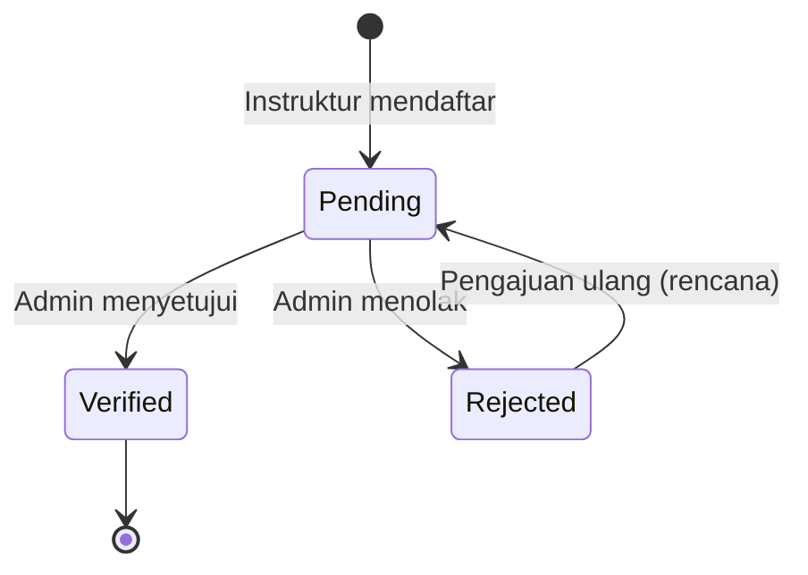

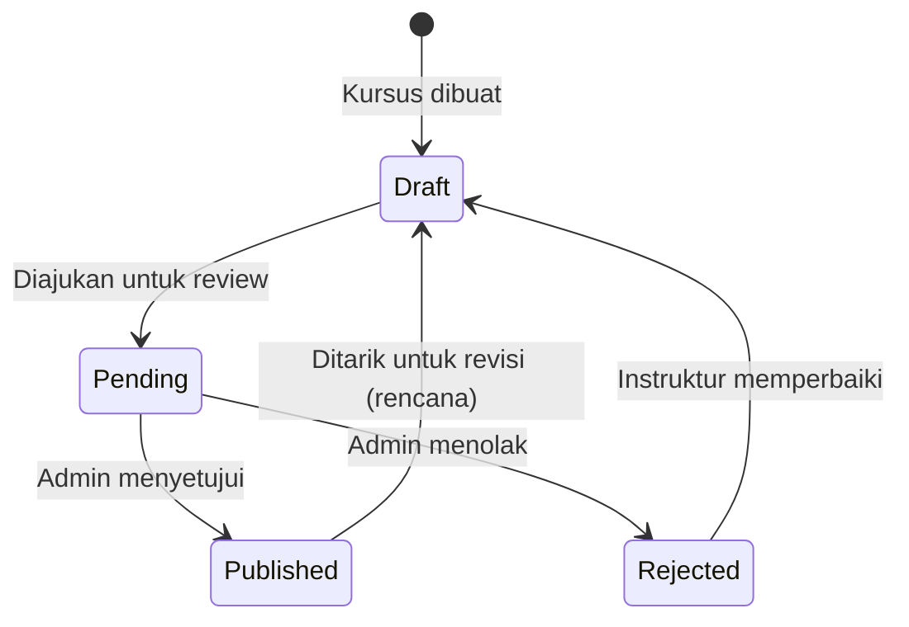

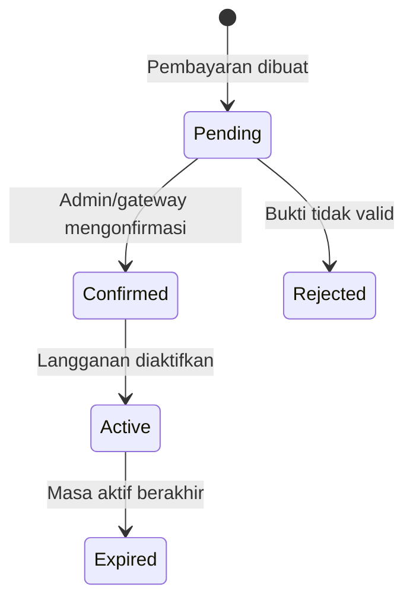

---

## 8. Arsitektur Sistem

### 8.1 Diagram Konteks

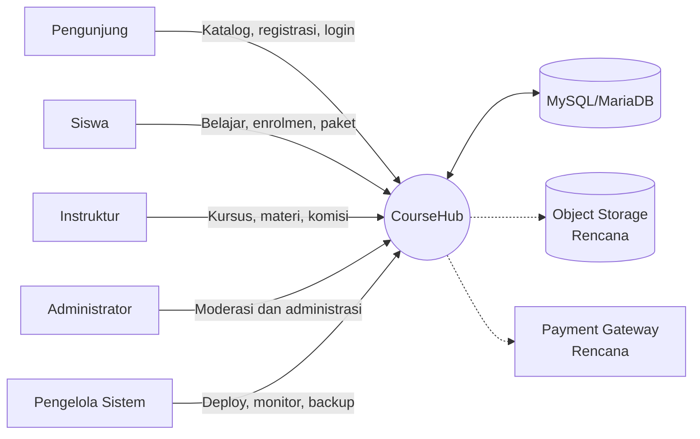

### 8.2 Diagram Komponen

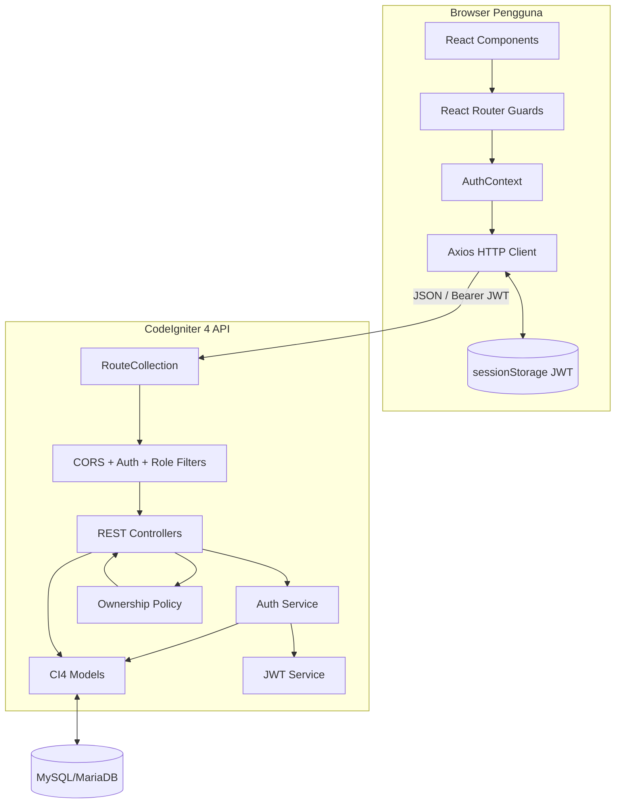

### 8.3 Data Flow Diagram Level 0

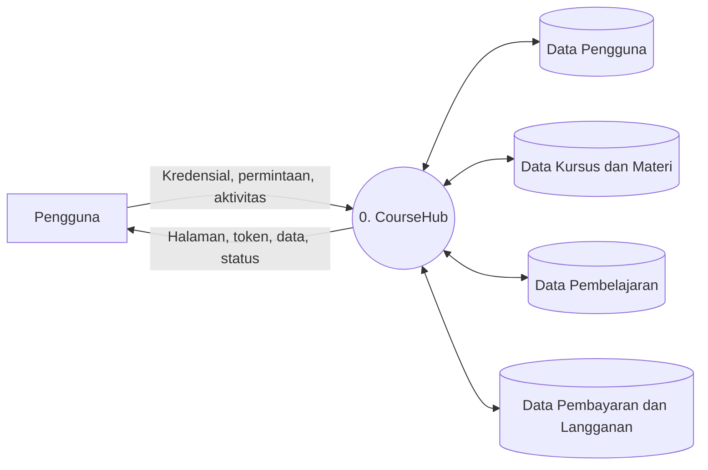

### 8.4 Data Flow Diagram Level 1

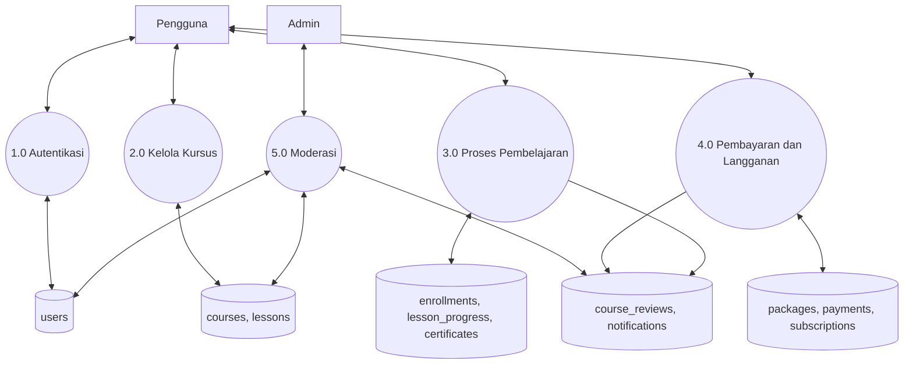

### 8.5 Diagram Deployment

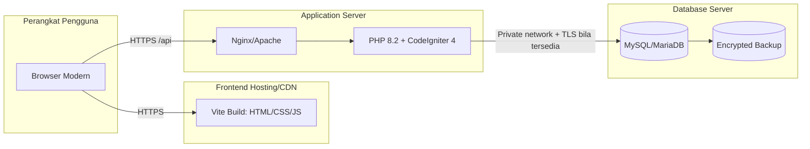

---

## 9. Diagram Analisis dan UML

### 9.1 Use Case Umum

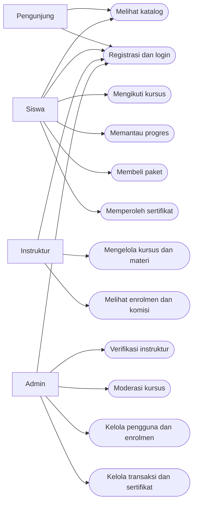

### 9.2 Sequence Diagram Login dan Pengalihan Peran

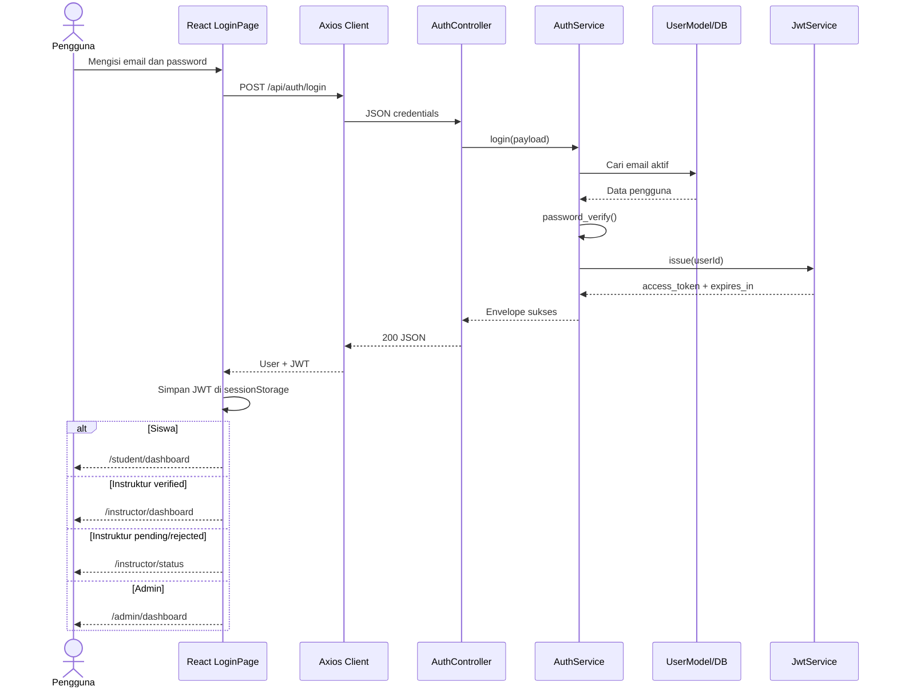

### 9.3 Sequence Diagram Membuat Kursus

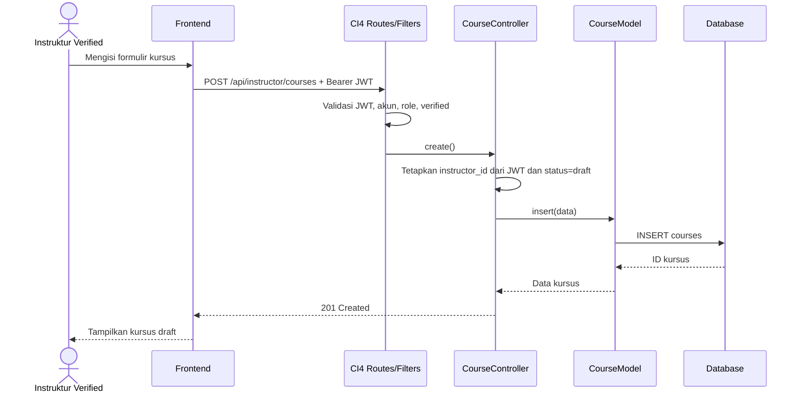

### 9.4 Sequence Diagram Enrolmen Siswa

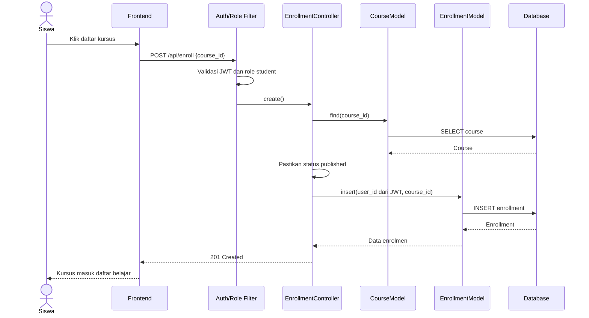

### 9.5 Activity Diagram Pembelajaran hingga Sertifikat

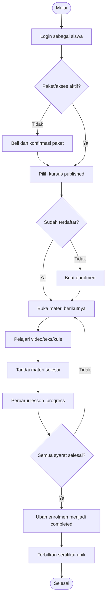

### 9.6 UML Class Diagram Backend

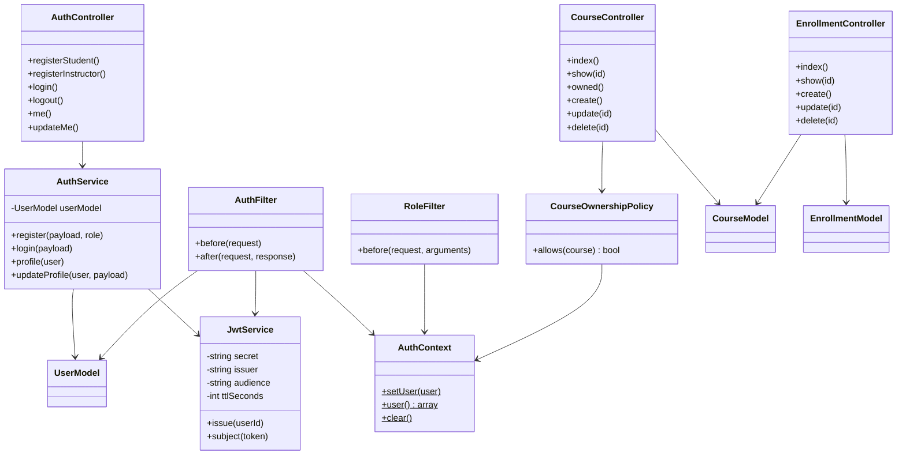

---

## 10. Perancangan Basis Data

### 10.1 Entity Relationship Diagram

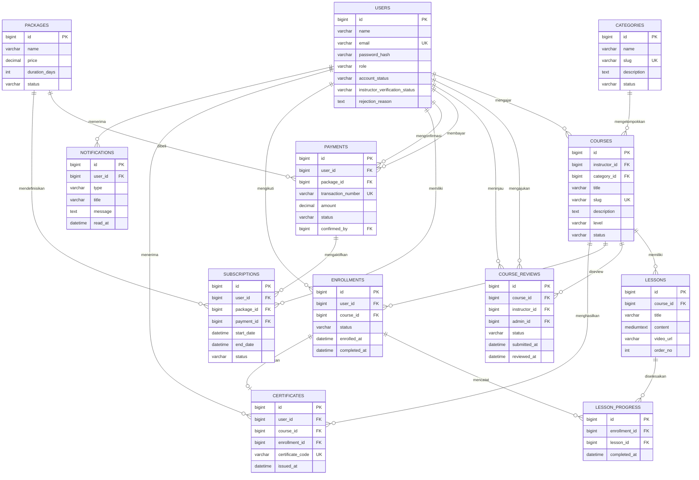

### 10.2 Kamus Data Ringkas

| Tabel | Tujuan | Kunci/constraint penting |
|---|---|---|
| `users` | Identitas, role, status akun/verifikasi | PK `id`, unique `email`, index role/status |
| `categories` | Kategori kursus | Unique `slug` |
| `courses` | Metadata kursus | FK instruktur/kategori, unique `slug`, status workflow |
| `lessons` | Materi per kursus | Unique `(course_id, order_no)` |
| `course_reviews` | Riwayat pengajuan dan moderasi | FK kursus, instruktur, admin |
| `packages` | Paket berlangganan | Harga, durasi, status |
| `payments` | Pembayaran paket | Unique nomor transaksi, FK user/package/admin |
| `subscriptions` | Masa akses siswa | FK user/package/payment, tanggal awal/akhir |
| `enrollments` | Keikutsertaan siswa | Unique `(user_id, course_id)` |
| `lesson_progress` | Penyelesaian materi | Unique `(enrollment_id, lesson_id)` |
| `certificates` | Sertifikat kelulusan | Unique kode dan unique `enrollment_id` |
| `notifications` | Pesan untuk pengguna | Index `(user_id, read_at)` |

### 10.3 Catatan Integritas

- Migration menggunakan `BIGINT UNSIGNED`; file lama `backend-ci4/database/coursehub.sql` hanya memuat empat tabel dengan struktur berbeda. Migration harus dijadikan sumber kebenaran dan SQL lama sebaiknya ditandai sebagai legacy atau diperbarui.
- Foreign key mengatur kombinasi `CASCADE`, `RESTRICT`, dan `SET NULL` sesuai dampak penghapusan.
- Nilai status masih berupa `VARCHAR`; konsistensinya dijaga oleh aturan validasi model dan konstanta `Config\Domain`.
- Proses pembayaran hingga aktivasi subscription nantinya wajib menggunakan database transaction.

---

## 11. Implementasi MVC Backend

### 11.1 Pemetaan MVC

| Lapisan | Lokasi | Tanggung jawab |
|---|---|---|
| Route | `backend-ci4/app/Config/Routes.php` | Mendefinisikan method, URI, controller, dan filter |
| Filter/middleware | `backend-ci4/app/Filters` | CORS, autentikasi JWT, RBAC/verifikasi |
| Controller | `backend-ci4/app/Controllers/Api` | Menerima HTTP request, memanggil service/model, mengirim JSON response |
| Service | `backend-ci4/app/Services/AuthService.php` | Use case autentikasi, validasi, hashing, profil |
| Policy | `backend-ci4/app/Policies/CourseOwnershipPolicy.php` | Aturan kepemilikan kursus |
| Model | `backend-ci4/app/Models` | Akses tabel, allowed fields, validation rules, timestamp |
| Entity/schema | Migration dan `Config\Domain` | Struktur DB dan vocabulary status |
| View | `backend-ci4/app/Views` | Halaman status backend; bukan UI utama aplikasi |

### 11.2 Alur Request MVC

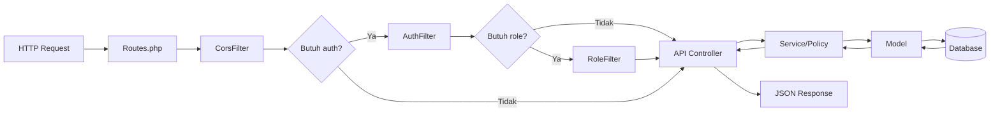

### 11.3 Tanggung Jawab Controller Aktif

- `AuthController`: registrasi, login, logout, profil, pembaruan profil.
- `AuthorizationController`: endpoint pemeriksaan akses per role.
- `CourseController`: katalog publik, kursus milik instruktur, CRUD kursus.
- `EnrollmentController`: enrolmen siswa dan administrasi enrolmen oleh admin.
- `HealthController`: status API dan koneksi database.

### 11.4 Prinsip Implementasi

1. Controller menjaga logika HTTP tetap tipis.
2. Identitas pengguna diperoleh dari `AuthContext` setelah JWT diverifikasi.
3. Field sensitif seperti `role`, `account_status`, `instructor_id`, dan status awal kursus dikendalikan server.
4. Model menggunakan `allowedFields` untuk mencegah mass assignment field yang tidak diizinkan.
5. Policy memisahkan pemeriksaan ownership dari controller.
6. Respons error produksi tidak boleh memuat stack trace, query, atau secret.

---

## 12. Implementasi Frontend

### 12.1 Stack Frontend

| Teknologi | Penggunaan |
|---|---|
| React 18 | Komponen UI dan state lokal |
| TypeScript | Kontrak tipe data dan kontrol kesalahan |
| Vite 6 | Development server dan production build |
| React Router 7 | Routing, redirect, protected route, role route |
| Axios | HTTP client dan interceptor JWT/401 |
| Tailwind CSS 4 | Utility styling |
| Lucide React | Ikon |
| Radix UI/MUI | Komponen UI pendukung |
| Motion/Recharts | Animasi dan visualisasi bila digunakan |

### 12.2 Struktur Frontend Utama

```text
frontend-react-ts/src/
├── main.tsx                         # Bootstrap React, BrowserRouter, AuthProvider
├── app/
│   ├── App.tsx                      # Route utama dan mayoritas dashboard/prototipe
│   ├── api/
│   │   ├── http.ts                  # Axios instance + JWT/401 interceptors
│   │   ├── authService.ts           # Parser kontrak autentikasi
│   │   ├── courseService.ts         # Service kursus, belum dipakai dashboard
│   │   └── enrollmentService.ts     # Service enrolmen, belum dipakai dashboard
│   ├── context/AuthContext.tsx      # Siklus sesi dan API autentikasi
│   ├── routes/
│   │   ├── ProtectedRoute.tsx       # Wajib login
│   │   └── RoleRoute.tsx            # Role + verifikasi instruktur
│   ├── features/auth/                # Registrasi, status, storage, tipe auth
│   ├── components/                   # Landing, shared, dan UI primitives
│   ├── data/constants.ts             # Data landing page
│   └── types/                        # Tipe kontrak API
└── styles/                           # CSS global, tema, Tailwind, overrides
```

### 12.3 Siklus Autentikasi Frontend

1. `main.tsx` membungkus aplikasi dengan `BrowserRouter` dan `AuthProvider`.
2. `AuthProvider` membaca JWT dari `sessionStorage`.
3. Jika token tersedia, frontend memanggil `GET /api/me`.
4. Axios interceptor menambahkan `Authorization: Bearer <token>`.
5. Respons 401 menghapus token dan memancarkan event `coursehub:unauthorized`.
6. `AuthProvider` mengubah status menjadi guest dan mengarahkan ke `/login`.
7. `ProtectedRoute` mencegah guest membuka dashboard.
8. `RoleRoute` mengarahkan pengguna ke dashboard kanonik sesuai role dan status instruktur.

### 12.4 Modul Tampilan Berdasarkan Peran

| Peran | Menu internal dashboard |
|---|---|
| Siswa | Beranda, Jelajahi Kursus, Kursus Saya, Progress, Paket Saya, Profil, Detail Kursus, Belajar, Sertifikat |
| Instruktur | Beranda, Kursus Saya, Materi, Enrolmen, Komisi, Profil |
| Admin | Beranda, Kelola Kursus, Kelola Pengguna, Instruktur, Enrolmen, Paket, Sertifikat, Transaksi & Komisi |

Menu tersebut saat ini dikendalikan oleh state `activeNav` pada satu URL dashboard per role, bukan masing-masing URL. Untuk deep-link, browser back/forward, analitik, dan pemisahan modul yang baik, menu sebaiknya menjadi nested route pada tahap pengembangan berikutnya.

### 12.5 State dan Integrasi Data

| Area | Implementasi saat ini | Target |
|---|---|---|
| Identitas/sesi | `AuthContext`, terhubung API | Pertahankan; tambah refresh/revocation bila diperlukan |
| Dashboard siswa | `useState`, konstanta/data lokal | Query API kursus, enrolmen, progress, paket |
| Dashboard instruktur | `useState`, data akun dan CRUD lokal | Query/mutation API kursus, materi, enrolmen, komisi |
| Dashboard admin | Data tabel dan aksi lokal | Query/mutation API admin dengan pagination |
| Notifikasi | Array lokal | API notifikasi dan polling/SSE sesuai kebutuhan |
| Error auth | `AuthApiError` terstruktur | Terapkan pola serupa ke seluruh service |

### 12.6 Kesenjangan Kontrak TypeScript

Kontrak `src/app/types/api.ts` belum sesuai penuh dengan backend:

- Tipe Course mengharapkan `category`, `price`, dan status `archived`, sedangkan backend mengembalikan `category_id`, `category_name`, tidak memiliki `price` pada tabel kursus, dan menggunakan `draft|pending|published|rejected`.
- Tipe level frontend menggunakan `pemula|menengah|lanjutan`, sedangkan backend/seeder menggunakan nilai seperti `beginner|intermediate` dan UI memakai jenjang sekolah.
- Tipe Enrollment mengharapkan `progress` serta status bahasa Indonesia, sedangkan tabel enrolment menyimpan `active|completed` dan progres berada pada tabel `lesson_progress`.
- Payload frontend menggunakan `userId` dan `courseId`; backend menerima `course_id` atau `courseId` dan sengaja mengabaikan identitas user dari klien.
- `courseService` dan `enrollmentService` belum dipanggil oleh `App.tsx`.

Sebelum integrasi penuh, buat satu kontrak API kanonik dan parser runtime untuk semua respons eksternal.

### 12.7 Catatan Maintainability Frontend

`App.tsx` berukuran lebih dari 5.000 baris dan memuat banyak domain sekaligus. Pemecahan yang disarankan:

```text
app/features/
├── courses/
├── learning/
├── enrollments/
├── subscriptions/
├── instructor/
├── admin/
├── certificates/
└── notifications/
```

Setiap feature idealnya memiliki `pages`, `components`, `api`, `schemas/types`, dan `tests` sendiri. Pemecahan dilakukan bertahap bersama regression test agar tidak mengubah perilaku.

---

## 13. Perancangan Route Frontend

### 13.1 Route yang Sudah Tersedia

| Path | Akses | Komponen/perilaku |
|---|---|---|
| `/` | Publik | `PublicLandingPage` |
| `/login` | Publik | `LoginPage` |
| `/register` | Publik | `AuthRegisterPage` |
| `/dashboard` | Login | Redirect ke dashboard kanonik berdasarkan role |
| `/student/dashboard` | Student | `DashboardPage role=student` |
| `/instructor/dashboard` | Instructor verified | `DashboardPage role=instructor` |
| `/instructor/status` | Instructor unverified | `VerificationStatusPage` |
| `/admin/dashboard` | Admin | `DashboardPage role=admin` |
| `*` | Semua | Redirect ke `/` |

### 13.2 Rekomendasi Nested Route

```text
/student/dashboard
/student/courses
/student/courses/:courseId
/student/my-courses
/student/learn/:courseId/lessons/:lessonId
/student/progress
/student/subscription
/student/certificates
/student/profile

/instructor/dashboard
/instructor/courses
/instructor/courses/new
/instructor/courses/:courseId/edit
/instructor/courses/:courseId/materials
/instructor/enrollments
/instructor/commission
/instructor/profile

/admin/dashboard
/admin/users
/admin/instructors
/admin/courses
/admin/enrollments
/admin/packages
/admin/payments
/admin/certificates
/admin/commissions
```

Route frontend hanya meningkatkan UX dan bukan batas keamanan. Semua otorisasi tetap wajib ditegakkan di backend.

---

## 14. Implementasi dan Kontrak REST API

### 14.1 Konvensi

- Base URL development: `http://localhost:8080`.
- Prefix API: `/api`.
- Format body: `application/json`.
- Autentikasi: `Authorization: Bearer <JWT>`.
- ID menggunakan integer positif.
- Timestamp backend saat ini berbentuk `Y-m-d H:i:s`; target kontrak sebaiknya ISO 8601 dengan timezone.
- Endpoint daftar sebaiknya mendukung `page`, `per_page`, `sort`, `search`, dan filter domain.

### 14.2 Daftar Endpoint yang Tersedia

| Method | Endpoint | Akses | Controller | Keterangan |
|---|---|---|---|---|
| GET | `/` | Publik | `Home::index` | Halaman home backend |
| GET | `/backend-status` | Publik | `Home::backendStatus` | Halaman status backend |
| OPTIONS | `/api/*` | Publik | Closure/CORS | Preflight CORS |
| GET | `/api/health` | Publik | `HealthController::index` | Status API dan DB |
| POST | `/api/auth/register-student` | Publik | `AuthController::registerStudent` | Registrasi role student |
| POST | `/api/auth/register-instructor` | Publik | `AuthController::registerInstructor` | Registrasi instructor pending |
| POST | `/api/auth/login` | Publik | `AuthController::login` | Login dan penerbitan JWT |
| POST | `/api/auth/logout` | Login | `AuthController::logout` | Logout stateless |
| GET | `/api/me` | Login | `AuthController::me` | Profil berdasarkan JWT |
| PUT | `/api/me` | Login | `AuthController::updateMe` | Ubah nama/email sendiri |
| GET | `/api/courses` | Publik | `CourseController::index` | Katalog published; query `category_id` opsional |
| GET | `/api/courses/{id}` | Publik | `CourseController::show` | Detail course published |
| POST | `/api/courses` | Instructor verified | `CourseController::create` | Legacy create course |
| PUT | `/api/courses/{id}` | Instructor verified + owner | `CourseController::update` | Legacy update course |
| DELETE | `/api/courses/{id}` | Instructor verified + owner | `CourseController::delete` | Legacy delete course |
| GET | `/api/student/check` | Student | `AuthorizationController::check` | Uji akses student |
| GET | `/api/instructor/check` | Instructor verified | `AuthorizationController::check` | Uji akses instructor |
| GET | `/api/instructor/courses` | Instructor verified | `CourseController::owned` | Kursus milik sendiri |
| POST | `/api/instructor/courses` | Instructor verified | `CourseController::create` | Create course kanonik |
| PUT | `/api/instructor/courses/{id}` | Instructor verified + owner | `CourseController::update` | Update course kanonik |
| DELETE | `/api/instructor/courses/{id}` | Instructor verified + owner | `CourseController::delete` | Delete course kanonik |
| GET | `/api/admin/check` | Admin | `AuthorizationController::check` | Uji akses admin |
| GET | `/api/admin/enrollments` | Admin | `EnrollmentController::index` | Daftar seluruh enrolmen |
| GET | `/api/admin/enrollments/{id}` | Admin | `EnrollmentController::show` | Detail enrolmen |
| PUT | `/api/admin/enrollments/{id}` | Admin | `EnrollmentController::update` | Update status enrolmen |
| DELETE | `/api/admin/enrollments/{id}` | Admin | `EnrollmentController::delete` | Hapus enrolmen |
| POST | `/api/enroll` | Student | `EnrollmentController::create` | Legacy create enrolmen |
| POST | `/api/enrollments` | Student | `EnrollmentController::create` | Create enrolmen |
| GET | `/api/enrollments` | Admin | `EnrollmentController::index` | Legacy administrasi enrolmen |
| GET | `/api/enrollments/{id}` | Admin | `EnrollmentController::show` | Legacy detail enrolmen |
| PUT | `/api/enrollments/{id}` | Admin | `EnrollmentController::update` | Legacy update enrolmen |
| DELETE | `/api/enrollments/{id}` | Admin | `EnrollmentController::delete` | Legacy delete enrolmen |

### 14.3 Endpoint yang Masih Dibutuhkan

| Kelompok | Endpoint target minimum |
|---|---|
| Kategori | `GET /categories`, CRUD admin |
| Materi | CRUD `/instructor/courses/{id}/lessons`, `GET /courses/{id}/lessons` dengan kontrol akses |
| Pembelajaran | `GET /student/enrollments`, `PUT /student/lessons/{id}/progress` |
| Moderasi kursus | submit review instruktur, list/approve/reject admin |
| Verifikasi instruktur | list/detail/verify/reject admin |
| Pengguna | list/detail/activate/deactivate admin |
| Paket | katalog publik dan CRUD admin |
| Pembayaran | create, upload bukti/gateway callback, verify/reject admin |
| Langganan | status langganan siswa dan aktivasi/expiry otomatis |
| Sertifikat | list, issue, verify public by code |
| Notifikasi | list, mark-read, mark-all-read |
| Komisi | ledger, withdrawal request, approval, status |
| Audit | list audit event untuk admin/operator |

### 14.4 Contoh Request dan Response

#### Registrasi Siswa

```http
POST /api/auth/register-student
Content-Type: application/json

{
  "name": "Siti Rahma",
  "email": "siti@example.com",
  "password": "password-kuat",
  "password_confirmation": "password-kuat"
}
```

```json
{
  "success": true,
  "message": "Registrasi berhasil.",
  "data": {
    "user": {
      "id": 10,
      "name": "Siti Rahma",
      "email": "siti@example.com",
      "role": "student",
      "account_status": "active",
      "instructor_verification_status": null,
      "rejection_reason": null
    }
  }
}
```

#### Login

```http
POST /api/auth/login
Content-Type: application/json

{
  "email": "student@coursehub.test",
  "password": "password123"
}
```

```json
{
  "success": true,
  "message": "Login berhasil.",
  "data": {
    "access_token": "<jwt>",
    "token_type": "Bearer",
    "expires_in": 7200,
    "user": {
      "id": 2,
      "name": "Sinta Student",
      "email": "student@coursehub.test",
      "role": "student",
      "account_status": "active",
      "instructor_verification_status": null,
      "rejection_reason": null
    }
  }
}
```

#### Membuat Kursus

```http
POST /api/instructor/courses
Authorization: Bearer <jwt-instructor-verified>
Content-Type: application/json

{
  "title": "Dasar Pemrograman Web",
  "category_id": 2,
  "description": "Materi HTML, CSS, dan JavaScript dasar.",
  "level": "beginner",
  "thumbnail": null
}
```

Server menetapkan `instructor_id` dari JWT dan `status` menjadi `draft`, walaupun klien mengirim field berbeda.

#### Membuat Enrolmen

```http
POST /api/enrollments
Authorization: Bearer <jwt-student>
Content-Type: application/json

{
  "course_id": 1
}
```

Server menetapkan `user_id` dari JWT. Field `user_id` dari request tidak boleh dipercaya.

### 14.5 Format Error

Target format konsisten:

```json
{
  "success": false,
  "message": "Validasi gagal",
  "errors": {
    "email": "Email tidak valid."
  }
}
```

Status HTTP yang digunakan/disarankan:

| Status | Makna |
|---:|---|
| 200 | Berhasil membaca/memperbarui/menghapus sesuai implementasi saat ini |
| 201 | Resource berhasil dibuat |
| 204 | Preflight atau operasi tanpa body bila distandardisasi |
| 400 | Request malformed |
| 401 | Token tidak ada/tidak valid/expired atau login gagal |
| 403 | Role, verifikasi, atau ownership tidak memenuhi |
| 404 | Resource tidak ditemukan atau sengaja disamarkan |
| 409 | Konflik unique data, misalnya email/enrolmen ganda |
| 422 | Validasi field gagal |
| 429 | Rate limit terlampaui |
| 500 | Kesalahan internal tanpa detail sensitif |
| 503 | API aktif tetapi database tidak terhubung |

### 14.6 Masalah Konsistensi REST Saat Ini

- Auth/health menggunakan key `success`, sedangkan course/enrollment menggunakan key `status`.
- Masih ada route legacy yang menduplikasi route kanonik.
- Belum ada pagination dan metadata daftar.
- Timestamp dan nilai enum belum memiliki kontrak tunggal lintas frontend/backend.
- Logout tidak mencabut JWT di server karena implementasinya stateless.

Targetkan envelope tunggal, versioning `/api/v1`, dokumentasi OpenAPI, dan periode deprecation route legacy.

---

## 15. Mitigasi Keamanan

### 15.1 Kontrol yang Sudah Tersedia

| Kontrol | Implementasi | Risiko yang dikurangi |
|---|---|---|
| Password hashing | `password_hash(PASSWORD_DEFAULT)` dan `password_verify()` | Kebocoran password plaintext |
| Validasi registrasi | Nama, email, password, konfirmasi | Input tidak valid |
| Email unik | Pemeriksaan aplikasi + unique key DB | Duplikasi akun/race condition |
| JWT signed | HS256, secret minimal 32 karakter | Pemalsuan token |
| Claims JWT | `iss`, `aud`, `iat`, `nbf`, `exp`, `sub` | Token lintas sistem dan token expired |
| Status akun | Auth filter menolak akun nonaktif | Akses akun diblokir |
| RBAC | `RoleFilter` | Akses lintas peran |
| Verifikasi instruktur | Instruktur non-verified ditolak pada route pengelolaan | Kursus dari instruktur belum disetujui |
| Ownership policy | Pencocokan `instructor_id` dengan user JWT | IDOR pada kursus |
| Server-controlled identity | User/instructor id berasal dari JWT | Impersonation melalui payload |
| Server-controlled role/status | Endpoint dan whitelist field | Privilege escalation/mass assignment |
| Katalog published-only | Query memfilter status | Kebocoran draft/rejected course |
| CORS allowlist | Origin berasal dari environment allowlist | Akses browser dari origin asing |
| Query Builder/Model | Parameterisasi akses DB | SQL injection |
| Auto-routing nonaktif | Hanya route eksplisit | Bypass controller/method tak terduga |
| Pesan login generik | Email/password salah disamakan | User enumeration dasar |
| Password disembunyikan | `safeUser()` dan hidden field model | Kebocoran hash pada API |
| Feature tests keamanan | Token, role, status, ownership, published course | Regresi otorisasi |

### 15.2 Risk Register dan Mitigasi

| ID | Risiko | Level | Kondisi saat ini | Mitigasi wajib |
|---|---|---:|---|---|
| SEC-01 | XSS mencuri JWT dari `sessionStorage` | Tinggi | Token dapat diakses JavaScript | Hilangkan sumber XSS, aktifkan CSP, sanitasi konten; evaluasi cookie HttpOnly Secure SameSite dengan pola CSRF yang benar |
| SEC-02 | Brute force/credential stuffing | Tinggi | Belum ada rate limit/login throttling | Rate limit per IP+akun, exponential backoff, monitoring, CAPTCHA adaptif setelah anomali |
| SEC-03 | JWT curian tetap aktif hingga expiry | Tinggi | Logout hanya menghapus token klien | TTL akses lebih pendek, refresh token rotation/revocation atau token version pada user untuk kebutuhan risiko |
| SEC-04 | Trafik plaintext | Kritis di produksi | HTTPS force default false untuk development | TLS pada reverse proxy, redirect HTTPS, HSTS, set `forceGlobalSecureRequests` sesuai deployment |
| SEC-05 | Security headers/CSP tidak aktif | Tinggi | CSP dan secureheaders global nonaktif | Aktifkan CSP bertahap, HSTS, X-Content-Type-Options, Referrer-Policy, frame-ancestors |
| SEC-06 | Secret JWT lemah/terekspos | Kritis | Validasi panjang tersedia, value tergantung environment | Generate random secret kuat, secret manager, rotasi, jangan commit/log secret |
| SEC-07 | CORS terlalu permisif/misconfig | Sedang | Allow credentials true walau JWT header digunakan | Allowlist exact production origins, hindari wildcard, hapus credentials bila tidak memakai cookie |
| SEC-08 | CSRF | Sedang | Filter CSRF global nonaktif; bearer header mengurangi risiko tradisional | Jika tetap bearer header, dokumentasikan model; jika pindah cookie, aktifkan CSRF token dan SameSite |
| SEC-09 | IDOR pada endpoint baru | Tinggi | Course sudah punya policy; modul baru belum ada | Terapkan ownership/scope policy pada lesson, progress, certificate, payment, notification |
| SEC-10 | Manipulasi status/transaksi | Kritis | Modul pembayaran belum terintegrasi | Server-controlled amount/status, signed webhook, idempotency key, DB transaction, audit log |
| SEC-11 | Upload berbahaya | Tinggi | Upload produksi belum ada | Allowlist MIME dan ekstensi, size limit, random name, malware scan, object storage privat, signed URL |
| SEC-12 | Data sensitif di log | Tinggi | Error class dicatat; kebijakan redaksi belum eksplisit | Redact Authorization, password, token, PII; structured logging dengan allowlist field |
| SEC-13 | Dependency vulnerability | Sedang | Banyak dependency frontend/backend | Lockfile tunggal, audit CI, Dependabot/Renovate, SBOM, patch cadence |
| SEC-14 | Data hilang/ransomware | Tinggi | Backup belum terdokumentasi | Backup terenkripsi, least privilege, offsite/immutable copy, restore drill |
| SEC-15 | Abuse health endpoint | Rendah | Detail yang tampil minimal | Pertahankan detail minimal publik; readiness detail hanya internal |
| SEC-16 | Tidak ada audit trail aksi admin | Tinggi | Belum ada audit log | Tabel append-only audit events, actor, action, target, before/after aman, request ID, timestamp |
| SEC-17 | Data demo di produksi | Tinggi | Seeder memiliki akun password diketahui | Jangan jalankan development seeder di produksi; deployment check wajib menolak akun demo |

### 15.3 Threat Model Ringkas STRIDE

| Kategori | Contoh pada CourseHub | Mitigasi |
|---|---|---|
| Spoofing | Memalsukan identitas user/instruktur | JWT signature, issuer/audience, TLS, MFA admin |
| Tampering | Mengubah `user_id`, status course, nominal pembayaran | Server-controlled fields, policy, transaction, signed webhook |
| Repudiation | Admin menyangkal approval/penolakan | Audit log append-only dan request ID |
| Information Disclosure | Hash password/token/PII bocor | Safe serializer, log redaction, encryption, least privilege |
| Denial of Service | Flood login, katalog, upload | Rate limit, timeout, body limit, caching, queue |
| Elevation of Privilege | Student mengakses admin atau instructor pending membuat course | RBAC, verified check, test matriks izin |

### 15.4 Checklist Hardening Produksi

- [ ] `CI_ENVIRONMENT=production` dan debug toolbar tidak terbuka.
- [ ] Document root web server menunjuk hanya ke `backend-ci4/public`.
- [ ] HTTPS, HSTS, dan secure headers aktif.
- [ ] JWT secret acak minimal 256 bit dan berada di secret manager.
- [ ] CORS hanya memuat domain frontend produksi.
- [ ] Akun DB memakai least privilege dan bukan root.
- [ ] Credential demo/seeder tidak ada di produksi.
- [ ] Rate limit login, registrasi, dan endpoint mahal aktif.
- [ ] CSP diterapkan dan diuji pada frontend.
- [ ] Error response tidak mengandung stack trace/query/path internal.
- [ ] Backup terenkripsi dan restore test berhasil.
- [ ] Audit dependency dan SAST/secret scan berjalan di CI.
- [ ] Log tidak menyimpan password, JWT, Authorization header, atau bukti pembayaran mentah.
- [ ] Retensi dan penghapusan data pengguna terdokumentasi.
- [ ] Incident response dan rotasi secret diuji.

---

## 16. Pengujian dan Kriteria Penerimaan

### 16.1 Kondisi Pengujian Saat Ini

Backend memiliki feature test yang mencakup:

- Registrasi siswa dengan role dari server dan tanpa hash password pada respons.
- Instruktur baru selalu pending.
- Email duplikat dan error validasi terstruktur.
- Login seluruh role aktif serta penolakan password salah/akun nonaktif.
- Token hilang, malformed, signature salah, expired, user hilang, dan akun nonaktif.
- Identitas profil berasal dari JWT.
- Pembaruan profil tidak dapat mengubah field privilege.
- RBAC student/instructor/admin.
- Penolakan instructor pending/rejected.
- Course create memakai instructor JWT dan status tidak dapat dipublish langsung.
- Ownership update/delete course.
- Katalog publik menyembunyikan draft.
- Enrolmen memakai identitas student JWT dan menolak course unpublished.
- Administrasi enrolmen hanya admin.

Frontend belum memiliki script test pada `package.json`; hanya `dev` dan `build`.

### 16.2 Strategi Pengujian Target

| Lapisan | Fokus | Contoh alat |
|---|---|---|
| Unit backend | Service, policy, state transition | PHPUnit |
| Feature/API | Route, filter, DB, JSON contract | CI4 Test + PHPUnit |
| Unit frontend | Parser, route redirect, reducer/helper | Vitest |
| Component | Form, error/loading/empty, aksesibilitas | Testing Library |
| E2E | Registrasi, login, enrolmen, course workflow | Playwright |
| Security | SAST, dependency, secret, DAST | Semgrep/CodeQL, audit, OWASP ZAP |
| Performance | P95 API dan page load | k6, Lighthouse |
| Recovery | Backup dan restore | Restore drill terjadwal |

### 16.3 Contoh Acceptance Criteria

#### AC-01 Login Siswa

```text
Given akun siswa aktif dengan password benar
When siswa mengirim login
Then API memberi 200, JWT, data role student
And frontend menyimpan sesi dan membuka /student/dashboard
```

#### AC-02 Penolakan Instruktur Pending

```text
Given akun instructor berstatus pending dan memiliki JWT valid
When mengakses /api/instructor/courses
Then API memberi 403
And frontend mengarahkan ke /instructor/status
```

#### AC-03 Ownership Kursus

```text
Given dua instructor verified dan kursus milik instructor A
When instructor B mengubah atau menghapus kursus tersebut
Then API memberi 403
And data kursus tidak berubah
```

#### AC-04 Enrolmen Aman

```text
Given siswa login dan course published
When request enrolmen mengandung user_id milik orang lain
Then server mengabaikan user_id request
And enrolmen menggunakan subject JWT
```

### 16.4 Quality Gate

Sebelum release:

1. Frontend production build berhasil.
2. Seluruh test backend dan frontend lulus.
3. Migration dapat dijalankan pada database kosong.
4. API contract test lulus.
5. Tidak ada secret dalam repository/build artifact.
6. Vulnerability kritis/tinggi telah ditangani atau memiliki acceptance resmi.
7. E2E happy path dan satu error path per use case utama lulus.
8. Manual QA dilakukan untuk ketiga role.
9. Backup dan rollback deployment tersedia.

---

## 17. Deployment dan Operasional

### 17.1 Kebutuhan Lingkungan

#### Frontend

- Node.js/pnpm atau npm sesuai lockfile yang ditetapkan tim.
- Environment `VITE_BACKEND_BASE_URL`.
- Static hosting/CDN dengan fallback SPA ke `index.html`.

#### Backend

- PHP 8.2+.
- Extension `intl`, `mbstring`, JSON, dan MySQLi.
- Composer dependencies.
- MySQL/MariaDB.
- Environment database, CORS, URL frontend, dan JWT.
- Web server document root ke folder `public`.

### 17.2 Konfigurasi Minimum Development

```dotenv
# frontend-react-ts/.env
VITE_BACKEND_BASE_URL=http://localhost:8080

# backend-ci4/.env
CI_ENVIRONMENT=development
app.baseURL='http://localhost:8080/'
database.default.hostname=localhost
database.default.database=coursehub
database.default.username=root
database.default.password=
database.default.DBDriver=MySQLi
CORS_ALLOWED_ORIGINS=http://localhost:5173
JWT_SECRET=<secret-acak-minimal-32-karakter>
JWT_ISSUER=coursehub-backend
JWT_AUDIENCE=coursehub-frontend
JWT_TTL_SECONDS=7200
```

Jangan memakai konfigurasi development tersebut apa adanya untuk produksi.

### 17.3 Urutan Menjalankan Lokal

```bash
# Terminal 1
cd backend-ci4
composer install
php spark migrate
php spark db:seed DevelopmentSeeder
php spark serve --port 8080

# Terminal 2
cd frontend-react-ts
npm install
npm run dev
```

Development seeder hanya untuk lokal/test karena memuat akun demo dengan password yang diketahui.

### 17.4 Monitoring Minimum

- Health endpoint: `GET /api/health`.
- Availability check dari luar infrastruktur.
- Error rate dan latency per endpoint.
- DB connection saturation dan slow query.
- Jumlah 401/403/422/429/500.
- Login failure anomaly.
- Job gagal untuk expiry subscription dan penerbitan sertifikat.
- Kapasitas disk, backup age, dan keberhasilan restore terakhir.

---

## 18. Kesenjangan Implementasi dan Roadmap

### 18.1 Prioritas 0: Konsistensi dan Keamanan Dasar

1. Tentukan kontrak API kanonik dan samakan tipe frontend/backend.
2. Integrasikan dashboard katalog dan enrolmen dengan service API yang sudah ada.
3. Standardisasi envelope `success`, error, enum, timestamp, dan pagination.
4. Aktifkan hardening produksi: HTTPS, headers, CSP, rate limit, secret management.
5. Tambahkan frontend test dan E2E login/RBAC.
6. Tandai atau hapus dari alur penggunaan file SQL legacy setelah migration dipastikan lengkap.

### 18.2 Prioritas 1: Alur Pembelajaran Inti

1. REST API kategori dan materi dengan ownership.
2. Endpoint daftar enrolmen siswa.
3. Endpoint progres materi yang idempotent.
4. Perhitungan progres di backend.
5. Integrasi halaman belajar dengan data API.
6. Penerbitan sertifikat dengan kode unik setelah completion.

### 18.3 Prioritas 2: Moderasi dan Administrasi

1. Endpoint verifikasi instruktur.
2. Endpoint submit/review/publish/reject kursus.
3. CRUD pengguna dan account status.
4. Audit log semua aksi admin.
5. Pagination, search, filter, dan export aman.

### 18.4 Prioritas 3: Monetisasi

1. API paket, pembayaran, dan subscription.
2. Payment gateway/webhook terverifikasi dan idempotent.
3. Aktivasi/expiry subscription otomatis.
4. Ledger komisi dan workflow pencairan.
5. Rekonsiliasi dan laporan keuangan.

### 18.5 Prioritas 4: Skalabilitas dan UX

1. Pecah `App.tsx` berdasarkan feature dan nested route.
2. Cache katalog publik dan optimasi query/index.
3. Object storage untuk thumbnail/video/dokumen.
4. Notifikasi real-time bila kebutuhan terbukti.
5. Observability lengkap, load test, dan disaster recovery drill.

### 18.6 Definition of Done per Fitur

Sebuah fitur dinyatakan selesai jika:

- Requirement dan acceptance criteria disetujui.
- Backend menerapkan autentikasi, otorisasi, validasi, dan error contract.
- Frontend memakai API nyata dan menampilkan loading/error/empty/success state.
- Unit/feature/component/E2E test relevan lulus.
- Migration/seed terdokumentasi bila ada perubahan data.
- Security review dan aksesibilitas dasar selesai.
- API/diagram/dokumentasi diperbarui.
- Manual QA melalui permukaan pengguna berhasil.

---

## 19. Kesimpulan

CourseHub telah memiliki fondasi teknis yang baik untuk aplikasi kursus daring: pemisahan SPA dan REST API, migration yang cukup lengkap, autentikasi JWT, RBAC, verifikasi instruktur, ownership kursus, dan feature test otorisasi. Fondasi tersebut sudah mendukung pengembangan terarah menuju sistem produksi.

Kesenjangan terbesar bukan pada desain halaman, melainkan pada integrasi data. Dashboard sudah menggambarkan cakupan produk yang luas, tetapi banyak operasinya masih berbasis state lokal. Prioritas implementasi berikutnya adalah menyatukan kontrak data, menghubungkan UI ke API nyata, menyelesaikan workflow materi/progres/moderasi/pembayaran, dan menerapkan hardening produksi. Dengan roadmap tersebut, prototipe visual dapat berkembang menjadi sistem yang konsisten, aman, dapat diuji, dan dapat dipelihara.

---

## 20. Lampiran

### 20.1 Traceability Matrix Ringkas

| Kebutuhan | UI | Route frontend | API/model | Pengujian saat ini |
|---|---|---|---|---|
| Registrasi siswa | `AuthRegisterPage` | `/register` | `register-student`, `AuthService`, `UserModel` | `AuthApiTest` |
| Registrasi instruktur | `AuthRegisterPage` | `/register` | `register-instructor` | `AuthApiTest` |
| Login dan sesi | `LoginPage`, `AuthContext` | `/login`, `/dashboard` | `login`, `me`, `JwtService`, `AuthFilter` | `AuthApiTest` |
| RBAC dashboard | `ProtectedRoute`, `RoleRoute` | Route per role | `RoleFilter` dan check endpoints | `AuthorizationApiTest` |
| Katalog published | UI katalog prototipe | Student dashboard | `GET /api/courses` | `AuthorizationApiTest` |
| CRUD course milik instruktur | UI lokal | Instructor dashboard | Course routes/model/policy | `AuthorizationApiTest` |
| Enrolmen siswa | UI lokal | Student dashboard | `POST /api/enrollments` | `AuthorizationApiTest` |
| Administrasi enrolmen | UI admin lokal | Admin dashboard | Admin enrollment routes | `AuthorizationApiTest` |
| Materi/progres | UI lokal | Student/instructor dashboard | Model tersedia, route belum ada | Belum ada |
| Paket/pembayaran | UI lokal | Student/admin dashboard | Model tersedia, route belum ada | Belum ada |
| Sertifikat | UI lokal | Student/admin dashboard | Model tersedia, route belum ada | Belum ada |

### 20.2 Struktur Repository

```text
CourseHub-new/
├── backend-ci4/
│   ├── app/
│   │   ├── Config/
│   │   ├── Controllers/Api/
│   │   ├── Database/Migrations/
│   │   ├── Database/Seeds/
│   │   ├── Filters/
│   │   ├── Libraries/
│   │   ├── Models/
│   │   ├── Policies/
│   │   ├── Services/
│   │   └── Views/
│   ├── public/
│   └── tests/
├── frontend-react-ts/
│   ├── src/app/
│   ├── src/styles/
│   └── package.json
└── DOKUMENTASI_ANALISIS_KEBUTUHAN_SISTEM_COURSEHUB.md
```

### 20.3 Glosarium

| Istilah | Arti |
|---|---|
| API | Antarmuka komunikasi antaraplikasi |
| REST | Gaya arsitektur layanan berbasis resource dan HTTP |
| SPA | Aplikasi web satu halaman yang dirender dinamis di browser |
| MVC | Pola Model-View-Controller |
| JWT | Token bertanda tangan untuk membawa identitas/claims |
| RBAC | Kontrol akses berdasarkan peran |
| CORS | Kebijakan browser untuk request lintas origin |
| CSRF | Serangan yang memaksa browser mengirim request atas nama pengguna |
| XSS | Injeksi script ke halaman web |
| IDOR | Akses object milik pengguna lain melalui manipulasi ID |
| Migration | Versi perubahan struktur basis data |
| Seeder | Data awal untuk development/pengujian |
| Enrolmen | Pendaftaran siswa pada sebuah kursus |
| Ownership | Pemeriksaan bahwa resource dimiliki aktor yang mengubahnya |
| Idempotency | Request berulang menghasilkan satu efek yang sama, penting untuk pembayaran/progres |

### 20.4 Referensi Implementasi Internal

- Arsitektur proyek: `README_STRUKTUR_PROJECT.txt`.
- Route backend: `backend-ci4/app/Config/Routes.php`.
- Konstanta domain: `backend-ci4/app/Config/Domain.php`.
- Migration: `backend-ci4/app/Database/Migrations`.
- Controller API: `backend-ci4/app/Controllers/Api`.
- Autentikasi backend: `backend-ci4/app/Services/AuthService.php` dan `backend-ci4/app/Libraries/JwtService.php`.
- Filter keamanan: `backend-ci4/app/Filters`.
- Pengujian backend: `backend-ci4/tests/feature`.
- Bootstrap frontend: `frontend-react-ts/src/main.tsx`.
- Routing dan dashboard: `frontend-react-ts/src/app/App.tsx`.
- Konteks autentikasi: `frontend-react-ts/src/app/context/AuthContext.tsx`.
- HTTP client dan service: `frontend-react-ts/src/app/api`.
- Route guard: `frontend-react-ts/src/app/routes`.

---

**Akhir dokumen.**
